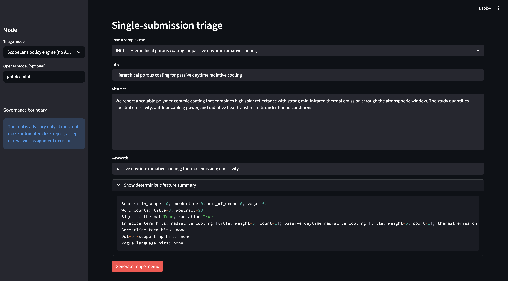
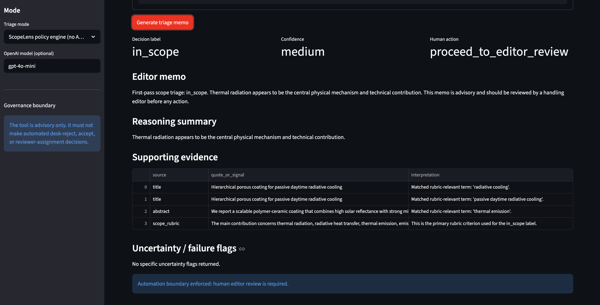

# ScopeLens: Editorial Scope Triage Memo Generator

ScopeLens is a small Streamlit app for editorial scope triage.

It is designed for thermal radiation manuscript submissions.

The user enters a title, abstract, and keywords. The app returns a structured triage memo. The memo includes a scope label, confidence, evidence, uncertainty flags, and a human review action.

The tool is advisory only. It does not make accept, reject, desk reject, or reviewer assignment decisions.

---

## 1. Context, user, and problem

### Target user

The target user is a handling editor or editorial assistant at a physics or engineering journal that covers thermal radiation.

### Workflow

The workflow is first pass scope triage.

It starts when a new manuscript arrives.

The editor usually sees:

```text
title
abstract
keywords
```

The editor then needs to decide whether the paper is likely in scope.

ScopeLens helps prepare a short memo for that decision.

### Scope labels

The app uses four labels.

| Label | Meaning |
|---|---|
| `in_scope` | Thermal radiation is central to the paper |
| `borderline` | Thermal radiation appears, but may not be the main contribution |
| `out_of_scope` | The paper belongs to another field |
| `insufficient_information` | The abstract is too vague to judge |

### Why this matters

Scope triage is repetitive.

It is also time sensitive.

It can be inconsistent when a paper uses overlapping terms. The word `radiation` can mean thermal radiation, radiation oncology, nuclear radiation, wireless radiation, or remote sensing.

A simple keyword check is not enough for many cases.

ScopeLens helps the editor inspect the evidence. It does not replace the editor.

### Domain fit

This project is linked to thermal radiation editorial work.

It is not a general writing assistant.

It is a narrow memo tool for one editorial workflow.

---

## 2. Solution and design

### What the app does

The app takes three inputs.

| Input | Description |
|---|---|
| Title | Manuscript title |
| Abstract | Manuscript abstract |
| Keywords | Author supplied keywords |

The app returns a structured memo.

| Output field | Description |
|---|---|
| `decision_label` | One of the four scope labels |
| `confidence` | `high`, `medium`, or `low` |
| `reasoning_summary` | Short reason for the label |
| `supporting_evidence` | Evidence from the title, abstract, keywords, or rubric |
| `uncertainty_flags` | Reasons the editor should be cautious |
| `editor_memo` | Short memo for the handling editor |
| `recommended_human_action` | Suggested next human step |
| `should_not_automate` | Always true |

### Why this version does not use RAG

The first project plan considered RAG.

The final version does not use RAG.

This was a design choice. The scope rules are short enough to encode as a compact rubric.

RAG would add extra failure points. It would require chunking, retrieval checks, and source quality checks. Accepted abstracts can also reflect past editorial choices, not formal scope policy.

The final design is simpler. It is also easier to evaluate.

### System design

ScopeLens has four main parts.

| Component | Role |
|---|---|
| Static rubric | Defines the four scope labels |
| Feature extractor | Detects thermal radiation signals, adjacent field signals, vocabulary traps, and vague text |
| Policy engine | Applies the rubric and returns a structured memo |
| Optional model mode | Uses the same schema if an OpenAI API key is provided |

The app can run without an API key.

This makes the app easier to grade and reproduce.

The optional OpenAI model mode uses the same rubric and output schema. It is useful for memo generation, but it is not required for the basic demo.

### Main design choices

| Design choice | Reason |
|---|---|
| Streamlit app | Easy for a grader to run and inspect |
| Fixed output schema | Keeps the memo consistent |
| Static scope rubric | Avoids unnecessary retrieval |
| Deterministic feature summary | Makes the result easier to audit |
| Human review boundary | Prevents automated editorial action |
| Keyword baseline | Gives a simple comparison point |

### Course concepts used

| Course concept | How it appears in this project |
|---|---|
| Structured output | The memo follows a fixed schema |
| Context design | The prompt uses the rubric, feature summary, and examples |
| Evaluation design | The app compares ScopeLens with a keyword baseline |
| Governance control | The app shows evidence, uncertainty flags, and a human review boundary |

---

## 3. Evaluation and results

### Baseline

The baseline is a simple keyword classifier.

It checks for obvious terms such as:

```text
radiative cooling
thermal emission
near field thermal radiation
emissivity
radiation oncology
wireless radiation
```

This baseline represents a simple status quo workflow.

A person or simple rule system scans for words and makes a rough scope judgment.

### Test set

The test set contains 36 synthetic and public style cases.

| Gold label | Number of cases | Purpose |
|---|---:|---|
| `in_scope` | 12 | Clear thermal radiation cases |
| `out_of_scope` | 12 | Unrelated cases and vocabulary traps |
| `borderline` | 6 | Adjacent heat transfer or system cases |
| `insufficient_information` | 6 | Vague abstracts |

### Example case types

| Case type | Example |
|---|---|
| Clear in scope | Passive daytime radiative cooling |
| Clear in scope | Near field thermal radiation |
| Borderline | Battery thermal management where radiation is minor |
| Out of scope | Radiation oncology imaging |
| Out of scope | Wireless radiation exposure |
| Insufficient information | Very vague abstract with no clear mechanism |

### What counted as good output

A good output should do four things.

| Requirement | Meaning |
|---|---|
| Correct label | The label should match the gold label |
| Visible evidence | The memo should point to text or rubric signals |
| Cautious uncertainty | Vague cases should not get confident labels |
| Human review | The output should not automate an editorial decision |

### Metrics

The evaluation reports:

| Metric | Purpose |
|---|---|
| Accuracy | Overall label match |
| Macro F1 | Balanced score across all four labels |
| Per label F1 | Performance for each label |
| Confusion matrix | Shows label mistakes |
| Evidence score | Checks whether visible support is present |

### Current pilot result

| Mode | Accuracy | Macro F1 | Main finding |
|---|---:|---:|---|
| Keyword baseline | 0.694 | 0.609 | Catches obvious terms, but fails on traps and vague cases |
| ScopeLens policy engine | 1.000 | 1.000 | Strong on this pilot set, but not external validation |

These results should not be overstated.

The test set was built with the same rubric used by the system.

The high policy engine score is a smoke test result. It does not prove that the tool is ready for real editorial use.

The main result is narrower. A structured rubric with evidence and uncertainty flags is more reliable than a simple keyword baseline on this pilot set.

### Known failure modes

| Failure mode | Why it matters |
|---|---|
| Radiation is only a minor detail | The app may overestimate scope fit |
| Uncommon terminology | The feature list may miss valid thermal radiation papers |
| Mixed field papers | The correct label may be debatable |
| Very short abstracts | The app should defer instead of guessing |
| Optional model mode | The model may treat surface terms as enough evidence |

The next evaluation step would be to add 20 to 40 new cases written independently of the rubric.

---

## 4. Artifact snapshot

The screenshots below show the Streamlit app running on a sample case.

### Input interface

The user loads or enters a title, abstract, and keywords.

The app also shows a deterministic feature summary.



### Generated memo

The app returns a structured advisory memo.

It includes the decision label, confidence, human action, editor memo, evidence, uncertainty flags, and automation boundary.



### Sample input

**Title**

```text
Hierarchical porous coating for passive daytime radiative cooling
```

**Abstract**

```text
We report a scalable polymer ceramic coating that combines high solar reflectance with strong mid infrared thermal emission through the atmospheric window. The study quantifies spectral emissivity, outdoor cooling power, and radiative heat transfer limits under humid conditions.
```

**Keywords**

```text
passive daytime radiative cooling; thermal emission; emissivity
```

### Sample output

| Field | Value |
|---|---|
| Decision label | `in_scope` |
| Confidence | `medium` |
| Human action | `proceed_to_editor_review` |

**Editor memo**

```text
First pass scope triage: in_scope. Thermal radiation appears to be the central physical mechanism and technical contribution. This memo is advisory and should be reviewed by a handling editor before any action.
```

**Supporting evidence**

| Source | Signal | Interpretation |
|---|---|---|
| title | passive daytime radiative cooling | Direct thermal radiation topic |
| abstract | strong mid infrared thermal emission | Thermal emission is central |
| abstract | radiative heat transfer limits | Radiative heat transfer is part of the method |
| rubric | central thermal radiation mechanism | Matches the in scope criterion |

---

## 5. Setup and usage

A grader can run the app without an API key.


git clone https://github.com/hanruizhang6688/project-ScopeLens.git
cd project-ScopeLens

### Create a virtual environment

macOS or Linux:

```bash
python -m venv .venv
source .venv/bin/activate
```

Windows PowerShell:

```powershell
python -m venv .venv
.\.venv\Scripts\Activate.ps1
```

### Install dependencies

```bash
pip install -r requirements.txt
```

### Run the app

```bash
streamlit run app.py
```

### Run one example

1. Open the Streamlit URL shown in the terminal.
2. Go to the `Single triage` tab.
3. Select a sample case from the dropdown.
4. Click `Generate triage memo`.
5. Check that the app returns a label, confidence, evidence, uncertainty flags, and human action.

---

## 6. Optional OpenAI model mode

The app can also call an OpenAI model.

This mode is optional.

Do not commit an API key.

Create a local `.env` file from the example file:

```bash
cp .env.example .env
```

Set these values in `.env`:

```text
OPENAI_API_KEY=your_key_here
SCOPELENS_MODEL=gpt-4o-mini
```

Then run:

```bash
streamlit run app.py
```

If the model call is not available, use the default ScopeLens policy engine mode.

---

## 7. Running the evaluation

Run the keyword baseline:

```bash
python eval/run_eval.py --mode baseline
```

Run the ScopeLens policy engine:

```bash
python eval/run_eval.py --mode offline_policy
```

Save prediction files:

```bash
python eval/run_eval.py --mode baseline --out eval_results_baseline.csv
python eval/run_eval.py --mode offline_policy --out eval_results_offline_policy.csv
```

The repository includes these files.

| File | Purpose |
|---|---|
| `data/test_cases.csv` | Test cases |
| `eval/run_eval.py` | Evaluation script |
| `eval_results/eval_results_baseline.csv` | Baseline predictions |
| `eval_results/eval_results_offline_policy.csv` | ScopeLens predictions |

---

## 8. Repository structure

```text
scopelens-final-project/
  app.py
  README.md
  requirements.txt
  .env.example
  .gitignore

  assets/
    sample_output.md
    scopelens_input.png
    scopelens_output.png

  data/
    test_cases.csv

  eval/
    run_eval.py

  src/
    __init__.py
    baseline.py
    evaluator.py
    feature_extractor.py
    llm_client.py
    policy_engine.py
    prompts.py
    schema.py
    scope_rubric.py

  eval_results_baseline.csv
  eval_results_offline_policy.csv
```

---

## 9. Data, privacy, and governance

This project uses synthetic and public style examples.

Do not paste private manuscripts into a public demo.

Do not commit:

```text
API keys
private editorial data
unpublished submissions
personally identifiable information
```

ScopeLens is not a decision system.

It is a memo tool for human editors.

A human editor must review every output before any editorial action.

---

## 10. Troubleshooting

### `streamlit` command not found

Use:

```bash
python -m streamlit run app.py
```

### `ModuleNotFoundError: No module named src`

Make sure you run the app from the repository root.

The root folder should contain:

```text
app.py
README.md
requirements.txt
src/
data/
eval/
```

### OpenAI key error

Use the default ScopeLens policy engine mode.

No API key is needed for that mode.

### Images do not show in README

Check that these files exist:

```text
assets/scopelens_input.png
assets/scopelens_output.png
```

### Evaluation files are missing

Run:

```bash
python eval/run_eval.py --mode baseline --out eval_results_baseline.csv
python eval/run_eval.py --mode offline_policy --out eval_results_offline_policy.csv
```